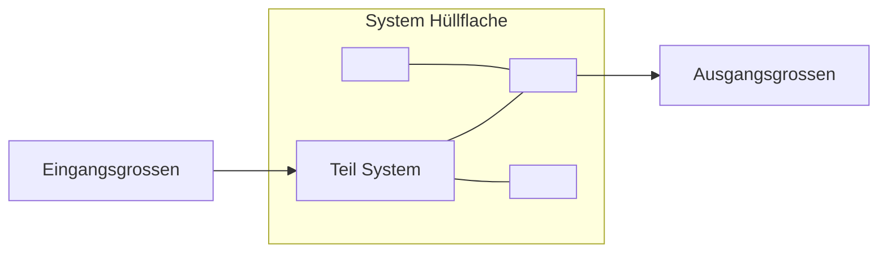

# Vorlessung Noten

<!-- @import "[TOC]" {cmd="toc" depthFrom=2 depthTo=4 orderedList=true} -->
<!-- code_chunk_output -->

1. [Vokabular](#vokabular)
2. [Einleitung](#einleitung)
3. [Daten problemstellungen und visualisierung](#daten-problemstellungen-und-visualisierung)
    1. [Daten](#daten)
    2. [Welche Probleme sollen gelöst werden ?](#welche-probleme-sollen-gelöst-werden)
    3. [Visualisierung](#visualisierung)
4. [Einsatzszenario zur Statistischen Datenanalyse](#einsatzszenario-zur-statistischen-datenanalyse)
    1. [Übersicht](#übersicht)
    2. [Datenbank und Zusammenstellung Lerndatensatz](#datenbank-und-zusammenstellung-lerndatensatz)
    3. [Merkmalsextraktion](#merkmalsextraktion)
    4. [Formalisierte Probleformulierungen](#formalisierte-probleformulierungen)
    5. [Merkmalbewertung (Frosetzung)](#merkmalbewertung-frosetzung)
        1. [Distanzen](#distanzen)
        2. [Klassifikationsorientierte Masse](#klassifikationsorientierte-masse)
    6. [Merkmalstransformation](#merkmalstransformation)
        1. [Idee Merkmalstranformationen](#idee-merkmalstranformationen)

<!-- /code_chunk_output -->

_____________________________
## Vokabular

|Deutsch|   |Franzosich| |Deutsch|   |Franzosich|
|---|---|---|---|---|---|---|
|Merkmale(n)|   |Caractéristique, paramètre   ||Ausreisser   |   |valeur aberrante  |
|einsatz(en)   |   |utilisation   ||schätzung   |   |estimation   |
|Bewertung   |   |évaluation   ||geeigneten   |   |adapté   |
|Abstand   |   |distance   ||Erzugen   |   |produire   |
|Wichtung   |   |pondération   ||Lerndatensatz   |   |Ensemble d'apprentissage |
|Datentupel   |   |point de donnée   ||Fehlerquellen   |   |sources d'erreur   |
|Auswahl   |   |sélection   ||Hinweise   |   |notes   |
|Masse   |   |mesurer   ||Zusammenhänge   |   |liens, relations, connexions  |
|zählen   |   |compter   ||ganzzahlig   |   |(nombre) entier   |
|Fehler   |   |erreur   ||Wertebereiche   |   |plage de valeurs (d'un paramètre)   |
|Entscheidung   |   |décision   ||Bemerkungen   |   |remarques   |
|Art(en)   |   |types, genres   ||Hüllfläche   |   |surface   |
|Zeitreihen   |   |série chronologique ||Umbgebung   |   |environnement   |
|unvollständig||incomplet   ||Anordnung   |   |arrangement   |
|Vorschlag   ||proposition|   |Entwurf   |   |conception   |
|Anwendungsphase||phase d'application ||notwendig||nécessaire|
|Rechenaufwand|   |complexité de calcul|   |auswählen|   |sélectionner|

_____________________________

## Einleitung

* Mündlinche Prüfung
* Date : 18/07/2018

_____________________________

## Daten problemstellungen und visualisierung

### Daten
- Datenstrukturen
  - Datentupel
  - Zeitreihen
  - Merkmale

**Skalenniveaus**
|Skalenniveau|Häufigkeiten|Grössenvergleich|Median|Mittelwert|Addition/Subtraktion|Multiplikation/Division|
|:---:|:---:|:---:|:---:|:---:|:---:|:---:|
|Nominalskala   |ja |x   |x   | x |x | x |
|Ordinalskala   |ja| ja | ja | x | x | x |
|Intervallskala   |ja | ja | ja | ja | x | x |
|Ratioskala   |ja | ja | ja | ja | ja | ja |

**Beispiel :**
* Nominalskala : Profesor Name, Farben
* Ordinalskala : Temperatur in linguistischen Termen (Warm/Kalt/...)
* Intervalskala : Temperatur in [°C] (*Ursprung*(origine?) nicht 0, 2°C nicht doppelt so warm wie 1°C)
- Ratioskala : Temperatur in [K]

### Welche Probleme sollen gelöst werden ?
*(gelöst = résolu)*

**Modellbildung**
Expertenbasierter Entwurf :
* viel Know-how
* gut interpretierbar
* problematische Quatizifierung
* unvollständig

Datenbasierter Entwurf :
* **gut quantifizierbar**
* schwerer interpretierbar
* unvollständig

Fustion sinnvoll

**Systemtheoretische Sicht**

Definition laut DIN :
* Anordnung von Gebilden, die miteinander in Beziehung stehen
*Gebilden=structures, liées entre elles*
* gegenüber ihrer Umbgebung *(environnement)* durch Hüllflache abgegrenzt *(séparé)*
* Nur spezielle Verbindungen gehen über *(à travers)* Hüllfläche (Ein- und Ausganggrïssen)
* Gebilde können auch (Teil-) Systeme sein

**Struktursuche und Parameterschätzung**
* Struktur:
  - Wahl der Ein- und Ausgangsgrössen eines Systems (Wieviele? Welche?)
  - mögliche Wertebereiche der Ein un Aus (z.B. reell, ganzzahlig)
  - Typ der Zusammenhänge in der Funktion
* Parameter :
* Vorwissen :
  - Wissen über das Problem, z.B. teilweise bekannte Strukturen un Parameter.
  - qualitative oder quantitative Hinweise für Bewertung
  - mögliche Fehlerquellen
* Lerndatensatz
  muss zur Struktur und Aufgabenstellung passen
* Entwurf :
  - Hypothesengenerierung
  Erzugen einer oder mehrerer möglicher geeigneten Systemstrukturen
  - Parameterschätzung :
  - Bewertung :
    quantitative Einschätzung Q eines gefundenen Systemmodells f() mit Struktur und Parameten anhand der Lerndaten und evtl. zusätzlichen Vorwissens
* Anwendung :
  routinemässige Erzeugung von Ausgangsgrössen unter Nutzung eines vorher entworfenen Systemmodells und neuer Eingangsgrössen

**Überwachtes Lernen**
* Regression
* Klassifikation (Eingangsgrösse ist reelwertig, Ausgangsgrösse ist nominal und kann als natürliche Zahl kodiert werden)
* Entscheidungsproblem (Ein- und Ausgangsgrössen ist nominal und kann als natürliche Zahl kodiert werden)
* Fuzzy-Klassifikation (Eingangsgrösse ist reelwertig, Ausgangsgrösse ist Fuzzy-Zugehörigkeit zwischen 0-1 zu verschiedenen Klassen)

**Unüberwachtes lernen** (Ausgangsgrösse für Lerndatensatz unbekannt)
* Clustering (Eingangsgrösse ist reelwertig, Ausgangsgrösse ist nominal und kann als natürliche Zahl kodiert werden)
* Fuzzy-Clustering (Eingangsgrösse ist reelwertig, Ausgangsgrösse ist Fuzzy-Zugehörigkeit zwischen 0-1 zu verschiedenen Klassen)

**Teilüberwachtes lernen**
* (Ausgangsgröße ist nur für einen Teil der Datentupel im Lerndatensatz bekannt)

### Visualisierung
* Scatterplot y=f(x) :
  - geeignet für ratio- oder intervallskalige Einzelmerkmale *(simple)*
  - zeigt *(montre)* Zusammenhänge zwischen Merkmalen
  - Klassen : Farben
  - unübersichtlich ab 2-3 Merkmalen
- Boxplots
  - Einzelmerkmale nach Klassen sortiert
  - Fahnen mit minimalen und maximalen Werten, die keine Ausreisser sind
  - Punkte für Ausreißer
  - kann nur 1 Merkmal zeigen, also keine Zusammenhänge zwischen Merkmalen
* Histogramme :
  - Auch ordinal und nominalskalierte
  - Klassen : als separate Histogramme
  - zeigt keine Zusammenhänge zwischen Merkmalen
- 2-D Histogramme :
  - zeigt Zusammenhänge zwischen 2 Merkmalen
- Korrelationsvisualiserungen :
  - keine Klasseninformation
  - gut auch für bis ca. 100 Merkmale
  - zeigt Zusammenhänge zwischen Merkmalen
- Zeitlicher Verlauf
  - Klassen durch Farben
  - de facto immer zeitdiskret
  - auch für abgeleitete Größen (z.B. Klassenmittelwerte)
  - problematisch bei vielen Datentupeln
- Heatmaps :
  - Werte farbkodieren
  - Klassen können durch Gruppieren berücksightigt *(être pris en compte)* werden

_____________________________

## Einsatzszenario zur Statistischen Datenanalyse
### Übersicht
**Einsatzszenario** *(scenario d'utilisation)*
(sieh Bild im vorlessung 3_1)
* nur ein Vorschlag
* automatisierbarer Teil möglich werden

**Vereinfachte Abläufe in der Anwendungsphase**
* Merkmalsselektion nicht mehr notwendig *(nécessaire)*
* Bewertungsmaße, visualisierung und (manuelle) Entscheidungsfindung optional
* **In der Regel starke Reduzierung Rechenaufwand**

### Datenbank und Zusammenstellung Lerndatensatz

### Merkmalsextraktion
### Formalisierte Probleformulierungen

### Merkmalbewertung (Frosetzung)

#### Distanzen
Definitheit : Abstand swischen zwei Objecten

**Spezificationen :**
d(Oi,Oj)>= 0
d(Oi,Ok)<=d(Oi,Oj)+d(Oj,Ok)

**Wichtige Distanzen :**
Minkowski-Distanz (n-Dimension Raum Distanz)
Euklidisch-Distanz (2-Dimension Raum)
Quadratische Form (matrix Dimension raum)

**Datentupeldistanzen :**
* abhängig vos ausgewählten Merkmalen, Datentupeln und Distanzmass
* unübersichtlich von vielen Datentupeln

#### Klassifikationsorientierte Masse
* relativen Anteil Fehler wählen

* Entscheidungskosten
* Spezifität, Sensitivität und *ROC-Kurven?*
(Equilibre entre positif, faux-positif, faux négatif, négatif)
On peut tracer une courbe qui calcule les qté suivantes :

Qsens = TP / (TP+FN)

Qspez = TN / (TN+FP)

|y=Bc \ y^=Bc | Ok | Fehler
| --- | --- | --- |
|Ok   | TP  | FN  |
|Fehler   | FP  | TN  |

* Regressionsorientierte Masse (1)
Evaluer l'écart entre la régression réelle et celle classifiée

### Merkmalstransformation

#### Idee Merkmalstranformationen
Projizieren in s-dimensionalen Raum, dass möglichst viel Informationen erhalten bleiben

*Comment on évalue la qualité d'une transformation par rotation ou projection*

_____________________________
