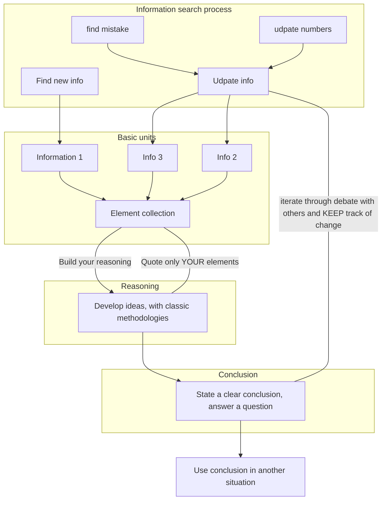

# Fiche Projet du PPH

**Problématique** : L'humanité se dirige-t-elle vers une situation où la réalité s'est effacée pour un monde virtuel ?

_ça c'est la question que je me pose à l'occasion mais l'élément central c'est est-ce que la dissertation est un bon moyen pour formuler une idée, la construire, la faire comprendre et (point intéressant pour moi) la faire évoluer?_

_____________________________

## What I want to say :

### State my way of doing

1. Basic, fundamental ideas/concepts, formulas (in case of science) are separated in *units/parts/fiches*. Because we usally haven't discovered those *facts* (they aren't necessarilly facts but when we use them we assume them to be trustable elements).
    - State the elements you will use, how you understand them and if necessary criticize them by highlighting if you think it's solide or not. This in a scientific proccess is stating your assumptions.
    - Said elements should be as succintly described as possible
    - This way you state precisely what you take from others, it's equivalent to citation but this way you never directly quote others in your analysis/explanation.
    - 2 majors advantages :
      - once you have written a unit, you can re-use it elsewhere at another time.
      - If you need to update a unit, because you want to enrich it with new elements, because numbers have evolved, because you/someone else discoverd a flaw or mistake you know precisely where to make an update/correction.

2. Explain your chain of thoughts, the steps of your reasoning but now these are only reasonings YOU come up with based on elements not quoted directly but quoted from the units *you* made.
    - This is your contribution, where you leave the shores of using knowledge backed by others and say what you believe in and why
    - This part should be follow the cartesian process of logic step after steps

3. State your conclusion, what is the final statement you wish to uphold, show the world, *re-use as a basic unit in another study*
      - Here, as in part 1, things should be stated in a very succint and short manner as this is what you want to be remembered
      -
**You need to keep track of updates and modifications at all steps, on the model of open-source developpement. This is what makes the whole process worth using, as showing clearly what elements caused an evolution is almost more important than the conclusion you reach.**

